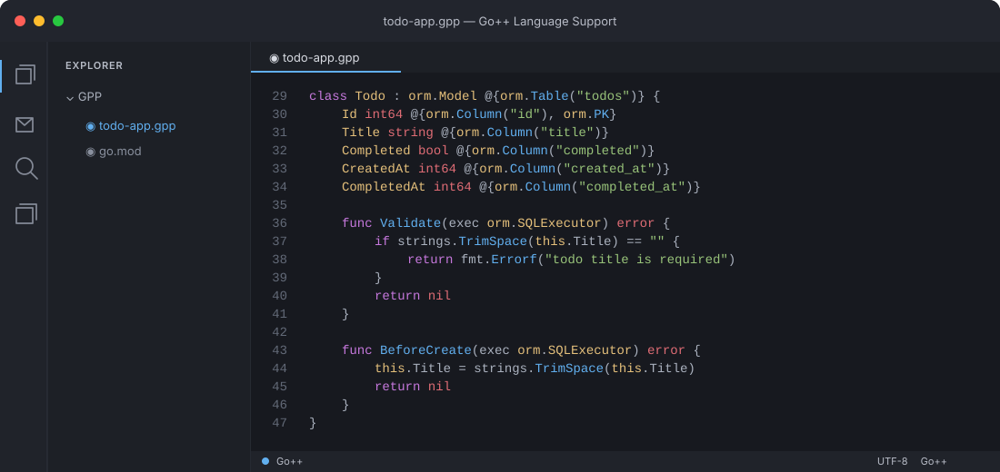

# Go++

<p align="center">
  
</p>

A [superset of Go](spec/compat.md) that provides modern features while staying true to the spirit of Go language.

Go++ is distributed under the [BSD 3-Clause license](LICENSE), the same license used by Go. Bundled third-party components may have separate licenses; see their notices.

## What's implemented?

Go++ adds expressive language features while keeping Go packages, generated
code, and the familiar build toolchain in reach. The guides below explain each
feature with comparisons and examples.

### Language features

- **[Classes](docs/features/classes.md)** — Group fields and methods around an
  implicit `this`, with concise construction and generated Go structs.
- **[Static methods and factories](docs/features/static-methods.md)** — Put
  type-level operations on a class and provide named ways to construct values.
- **[Polymorphism](docs/features/polymorphism.md)** — Use class values through
  compatible base types and interfaces, including when calling methods.
- **[Multiple inheritance](docs/features/multiple-inheritance.md)** — Compose
  behavior from multiple base classes, with qualified access when members conflict.
- **[Overloading](docs/features/overloading.md)** — Reuse a function or method
  name for different arities and statically distinguishable argument types.
- **[Named arguments and defaults](docs/features/named-arguments.md)** — Make
  call sites clearer and omit arguments that have a declared default.
- **[Structural records](docs/features/records.md)** — Pass composite values
  without declaring one-off structs for every function boundary.
- **[Enums](docs/features/enums.md)** — Define closed, named value sets with
  grouped declarations, validation, ordered values, and member metadata.
- **[Lambdas and the prelude](docs/features/lambdas.md)** — Write concise
  functions and use familiar collection, string, and map helpers.
- **[Extension methods](docs/features/extensions.md)** — Add compile-time
  methods to existing types, including several types in one extension block.
- **[String interpolation](docs/features/interpolation.md)** — Embed values in
  quoted or raw strings, with formatting and `String()` support.
- **[Regular expressions](docs/features/regular-expressions.md)** — Compile
  and use regular expressions through concise prelude helpers.
- **[Safe access](docs/features/safe-access.md)** — Use `?.` to access members
  of nullable class values without repeating explicit nil checks.
- **[Lazy error fallback](docs/features/error-fallback.md)** — Use `??` to
  evaluate a fallback only when the value on its left is absent or erroneous.
- **[Exception handling](docs/features/exceptions.md)** — Keep Go-style error
  values while adding `throw`, `try`, typed `catch`, and `finally` syntax.
- **[Program exit hook](docs/features/at-exit.md)** — Register `atExit` work
  that runs during normal program shutdown.
- **[Annotations and introspection](docs/features/annotations.md)** — Declare
  typed metadata, validate its targets, and inspect it at runtime.

### Application features and standard library

- **[Serialization](docs/features/serialization.md)** — Generate JSON, YAML,
  and GOB conversion methods from class annotations and field metadata.
- **[HTTP servers and routes](docs/features/http.md)** — Build servers with
  annotated routing, request binding, middleware, and lifecycle hooks.
- **[OpenAPI, Swagger, and OAuth](docs/features/api-documentation.md)** —
  Generate API documentation and interactive Swagger UI, with OAuth/OIDC support.
- **[ORM and SQL](docs/features/orm.md)** — Map annotated models to SQL and use
  database operations that invoke validation and lifecycle hooks.
- **[Typed templates](docs/features/templates.md)** — Define HTML/XML templates
  as functions and render them with Go's `html/template` protections.
- **[External template reloads](docs/features/template-reload.md)** — Reload
  `.gpp.tpl` files during development without rebuilding the server.
- **[Embedded assets](docs/features/embedded-assets.md)** — Include files and
  directories in the program through source-level declarations.
- **[Cron scheduling](docs/guide/standard-library/cron.md)** — Schedule
  annotated functions or dynamic jobs with explicit start and stop controls.
- **[Suite-based tests](docs/features/testing.md)** — Organize tests into
  suites, methods, and annotations, then run them through `gpp test`.

### Go compatibility and tooling

- **[Go compatibility](docs/features/packages.md)** — Use ordinary Go imports
  and dotted Go++ packages mapped to module paths; standalone programs can omit
  `package main`.
- **[Mixed Go and Go++ builds](docs/features/mixed-go.md)** — Call Go from Go++
  and Go++ from Go while compiling both languages in one project.
- **[Project CLI](docs/features/project-cli.md)** — Initialize, build, run,
  test, format, and inspect Go++ projects with the `gpp` command.
- **[Formatter](docs/features/formatter.md)** — Format Go++ syntax consistently
  and check formatting in CI.
- **[Source documentation](docs/features/source-docs.md)** — Read declarations
  and API documentation directly from Go++ source.
- **[Language server](docs/features/language-server.md)** — Get editor
  diagnostics, completion, navigation, semantic highlighting, and quick fixes.

### Visual Studio Code

The [Go++ VS Code extension](https://github.com/telgatech/gpp-vscode) provides
Go++ syntax highlighting, snippets, formatting, and optional language-server
support for diagnostics, completion, and navigation.

The editor view below shows the [`Todo` model in the full example](examples/todo-app.gpp).



## Install and build

The repository root is the installable Go++ CLI:

```bash
go install github.com/telgatech/gpp@latest
```

It provides one `gpp` executable with project commands:

```text
gpp init|compile|build|run|clean|fmt|test|doc|env|doctor|version|lsp
```

Create and run a starter project:

```bash
gpp init hello
cd hello
gpp run
```

`gpp init` creates a root `go.mod`, runs `go mod tidy`, and initializes a Git
repository with an `init` commit when the target is not already inside a Git
worktree. The initial commit includes only the generated project files.

Build a native executable. Intermediate Go source remains in the hidden
compiler workspace rather than beside the Go++ source:

```bash
gpp build examples/hello.gpp -o ./hello
```

Use `gpp doctor` to check the Go toolchain and embedded standard library, and
`gpp clean` to remove generated build artifacts.

Format Go++ source with the shared canonical formatter. It uses four-space
indentation, preserves comments and opaque literal/template content, and
supports CI-friendly check mode:

```bash
gpp fmt examples/hello.gpp
gpp fmt --check ./...
gpp fmt --stdout examples/hello.gpp
```

Pass `-emit-go` to `gpp build` when you want the generated Go workspace path
reported for inspection.

Go++ tests use the bundled `gpp/test` suite library and ordinary Go test
execution underneath:

```bash
gpp test examples/testing.gpp
gpp test --tag crud examples/testing.gpp
gpp test --priority high examples/testing.gpp
```

The compiler's CI also runs `go test ./...` and
[`scripts/smoke-examples.sh`](scripts/smoke-examples.sh). That smoke test creates
a fresh project with `gpp init`, copies in the complete examples tree, then
runs or builds every example (and executes the Go++ testing example). Run it
locally before submitting compiler changes:

```bash
./scripts/smoke-examples.sh
```

Inspect Go++ source-level documentation without exposing generated Go:

```bash
gpp doc gpp/http.Server
gpp doc string.TrimSpace
gpp doc --json gpp/http.Server
gpp doc --search template
```

Start the editor language server over standard input/output:

```bash
gpp lsp
```

The server keeps open-document overlays in memory and provides diagnostics,
completion, hover, navigation, references, rename, symbols, formatting, and
signature help without running a Go backend build on every change. Use
`gpp lsp --log=/tmp/gpp-lsp.log` when protocol-side diagnostics are needed;
logs never go to stdout.

## Documentation site

The technical documentation is built with VitePress. It includes a practical
landing page, getting-started and language guides, compiler/tooling notes, and
the specifications mirrored from `spec/` at build time:

```bash
npm install
npm run docs:dev
```

Build and preview the static site locally:

```bash
npm run docs:build
npm run docs:preview
```

Pushes to `main` build and deploy the site through GitHub Pages using the
workflow in `.github/workflows/docs.yml`. In the repository settings, set
Pages → Build and deployment → Source to **GitHub Actions** once.

## Build and run

For a complete project build, use the `build` subcommand. It clears stale
generated source, runs `go mod tidy` to resolve imports, and runs `go build`:

```bash
gpp build examples/hello.gpp
```

Use `run` for the same generation and dependency setup followed by execution:

```bash
gpp run examples/hello.gpp
```

During `gpp run`, external `.gpp.tpl` sources are watched when used with
`gpp/http.Server`; valid edits reload automatically and invalid edits leave
the previous templates active. Production `gpp build` uses the compiled
template sources without starting a watcher.

Use a separate output directory when switching between standalone examples:

```bash
gpp run -output /tmp/gpp-orm examples/orm.gpp
```

Multiple Go++ files can be passed to the same build. For example, the
cross-package example is built and run as one generated project:

```bash
gpp run \
  examples/packages/people.gpp \
  examples/packages/main.gpp
```

Go++ and Go can also live in the same build. The mixed-compilation examples
demonstrate both directions:

```bash
gpp run -output /tmp/gpp-go-from-gpp examples/mixed/go_from_gpp
gpp run -output /tmp/gpp-go-imports-gpp examples/mixed/go_imports_gpp
```

The first lets Go++ call functions from `native.go`; the second lets ordinary
Go import the generated `generated/mixed` package.

The ORM example also resolves its SQLite dependency automatically:

```bash
gpp run -output /tmp/gpp-orm examples/orm.gpp
```

Build an executable at a chosen path with `-o`:

```bash
gpp build -o ./hello examples/hello.gpp
```

Generated Go is written to a stable, per-project workspace under the system
cache. The CLI creates that workspace's `go.mod` with the default module path
`generated`; choose another path with `-module` when local Go package imports
need a real module path. Set `GPP_CACHE` to choose the cache root:

```bash
GPP_CACHE=/var/cache/gpp gpp -module example.com/myapp examples/*.gpp
```

Choose a different generated output directory with `-output`:

```bash
gpp -output build/gpp examples/hello.gpp
```

The standard Go++ prelude is available automatically. Disable it for minimal
or diagnostic builds with `-no-prelude`.

The enum example demonstrates implicit and explicit values, grouped enum
declarations, validated conversion, and metadata:

```bash
gpp run examples/enums.gpp
```

Expression-level error fallback is demonstrated by:

```bash
gpp run examples/expr_catch.gpp
```

Class introspection exposes generated `name`, `fields`, `methods`,
`annotations`, `owner`, `type`, `get`, `set`, and `addr` metadata while
preserving ordinary Go structs and stdlib interoperability.
